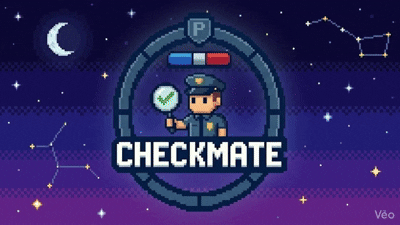
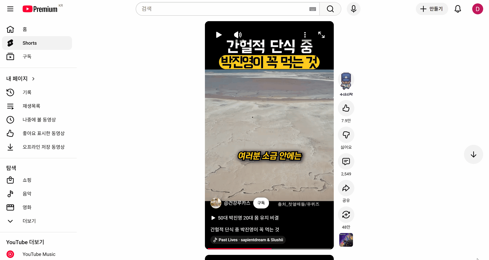
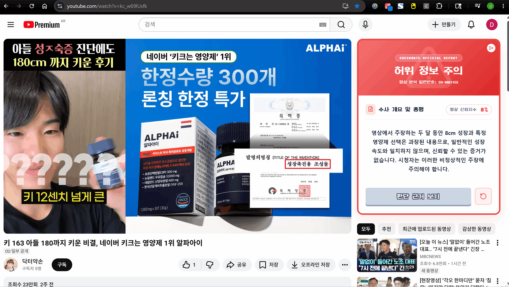
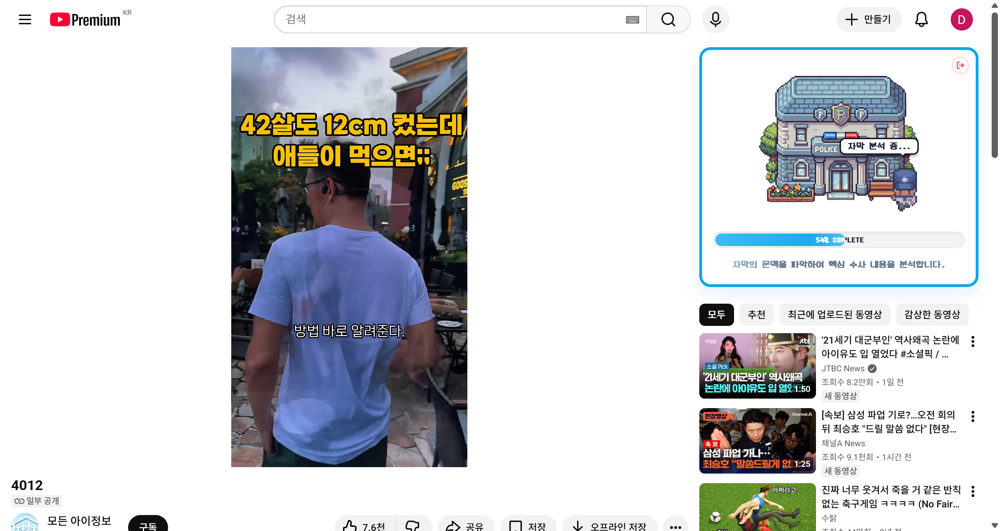
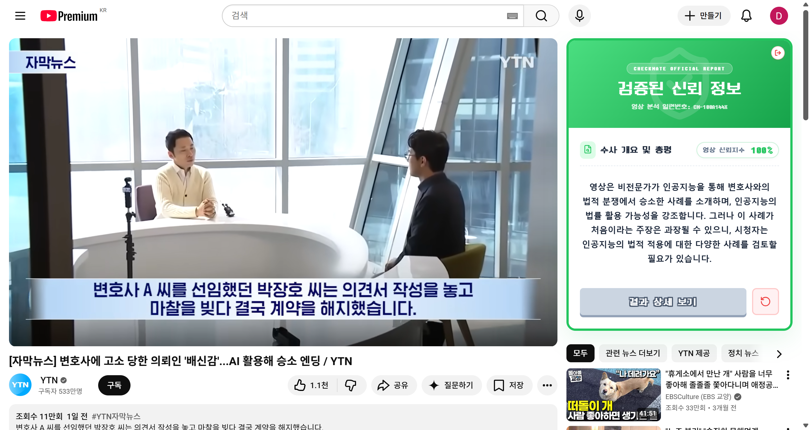
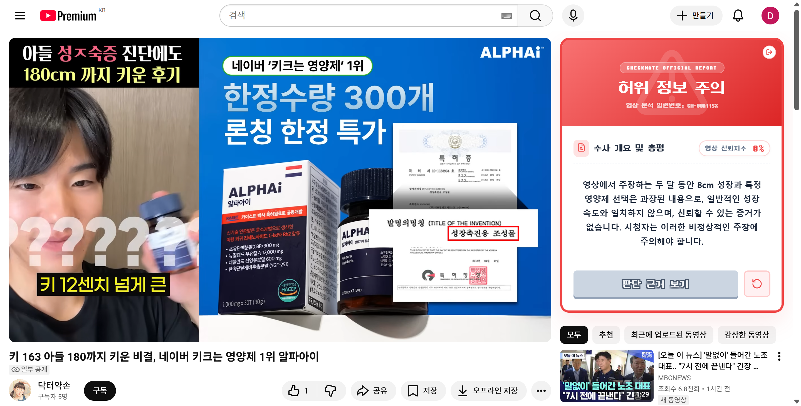
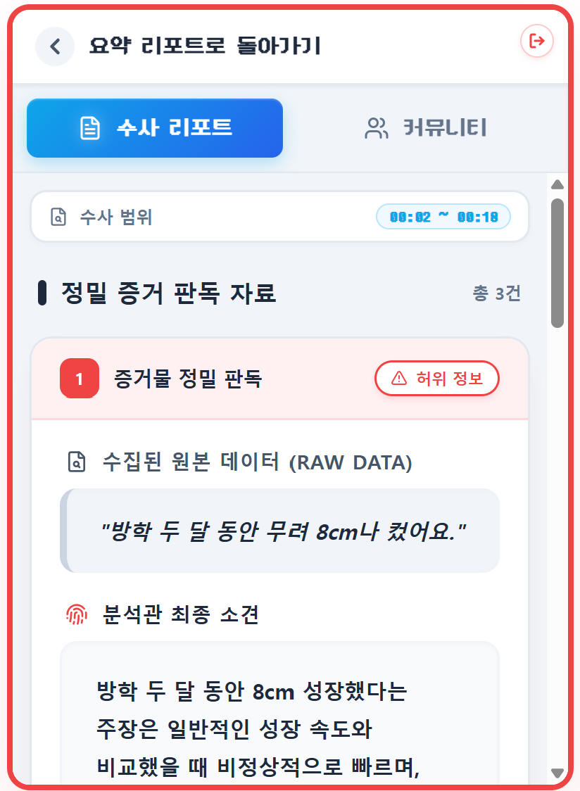
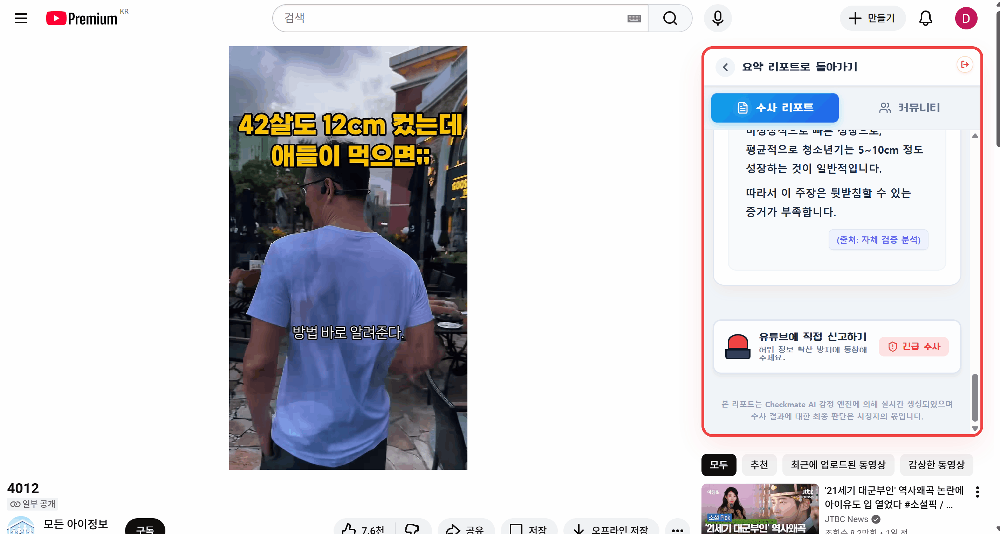
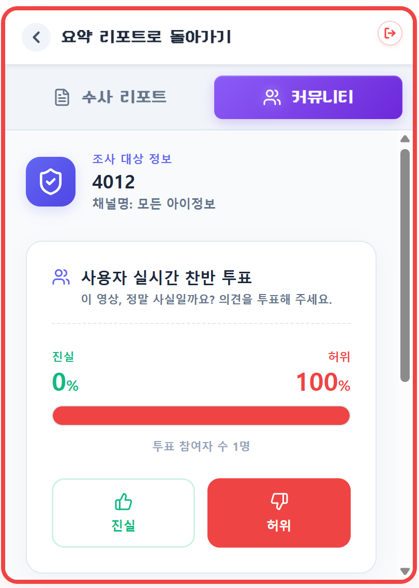
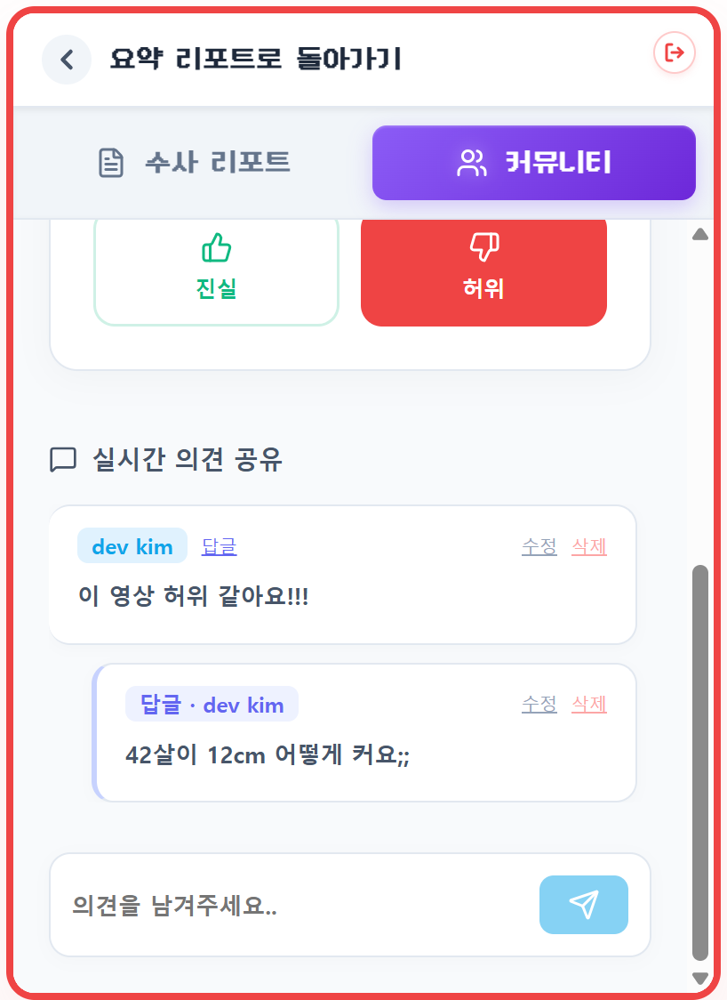

# ✅ CheckMate

{width=450}

> **AI 기반 유튜브 영상 팩트체크 서비스**  
> 유튜브 영상의 핵심 주장을 추출하고, 신뢰 가능한 근거와 비교해 허위·과장 가능성을 분석하는 근거 제시형 팩트체크 플랫폼

---

## 📌 프로젝트 한눈에 보기

- **서비스명**: CheckMate (체크메이트)
- **한 줄 소개**: 영상 속 주장의 진위 여부를 근거와 함께 판별해주는 AI 팩트체크 서비스
- **핵심 키워드**: 유튜브 팩트체크, 근거 기반 검증, 허위·과장 탐지, 커뮤니티, 원터치 신고, AI 교차 검증
- **핵심 가치**: 단순 요약이 아닌, 주장을 분리하고 신뢰할 수 있는 출처와 비교하여 객관적인 판단 기준(근거)을 제공


---

## 프로젝트 소개

**CheckMate**는 유튜브 영상 링크를 입력하면 영상 자막과 댓글 흐름을 분석해 핵심 주장을 추출하고, 신뢰 가능한 자료와 교차 검증하여 허위·과장 가능성을 판단하는 **AI 기반 유튜브 팩트체크 플랫폼**입니다.

정보가 쏟아지는 유튜브 환경에서는 영상 내용의 사실 여부를 시청자가 일일이 확인하기 어렵습니다. 잘못된 정보나 과장된 주장이 여과 없이 확산되는 문제를 해결하기 위해, CheckMate는 단순한 영상 요약에 그치지 않고 **주장을 검증 가능한 단위로 분리**합니다.

CheckMate는 다음과 같은 검증 흐름을 제공합니다:
- 유튜브 영상 자막 및 댓글 분석을 통한 핵심 주장 추출
- 신뢰 가능한 근거 자료와의 AI 교차 검증
- **"사실", "일부 과장", "허위 가능성 높음", "검증 어려움"** 4가지 형태의 명확한 결과 도출
- 결과뿐만 아니라 **어떤 부분이 왜 문제인지, 어떤 출처와 충돌하는지**에 대한 상세 근거 제시

또한 **원터치 신고 기능**과 사용자 간 **논의 커뮤니티**를 통해 정보의 신뢰성을 함께 만들어가는 건강한 플랫폼을 지향합니다.

---

## 프로젝트 키워드

`유튜브 팩트체크` `주장 추출` `교차 검증` `허위 정보 탐지` `LLM` `원터치 신고` `집단지성 커뮤니티` `근거 제시형 AI`

---

## 핵심 가치

### 1) 투명한 근거 제시형 검증
AI가 도출한 결과만 맹목적으로 제공하는 것이 아니라, 판단의 기준이 된 신뢰할 수 있는 출처와 구체적인 충돌 지점을 함께 제공하여 사용자의 올바른 판단을 돕습니다.

### 2) 입체적인 판별 시스템
이분법적인 흑백 논리에서 벗어나 "사실", "일부 과장", "허위 가능성 높음", "검증 어려움"으로 결과를 세분화하여 영상의 맥락을 정확하게 분석합니다.

### 3) 간편한 사용성 (원터치 신고)
복잡한 절차 없이 유튜브 링크 입력 및 원터치 신고 버튼만으로 빠르고 쉽게 팩트체크를 요청하고 결과를 확인할 수 있습니다.

### 4) 참여형 정보 검증 커뮤니티
AI의 팩트체크 결과를 바탕으로 사용자들이 추가적인 의견을 나누고 토론할 수 있는 장을 마련하여, 집단 지성을 통한 2차 검증을 가능하게 합니다.

---

## 전체 플로우

[화면]
- 숏폼

{width=450}

- 롱폼

{width=450}


---


## 주요 기능

### 🕵️‍♂️ 1) 유튜브 영상 팩트체크 검증
- 유튜브 영상 링크 입력 시 자막 및 댓글 텍스트 자동 추출
- 영상 내 핵심 주장을 검증 가능한 단위로 분할
- 신뢰도 높은 웹 출처와 교차 검증하여 4단계 진위 여부 판별 (사실/일부 과장/허위 가능성 높음/검증 어려움)
- 충돌하는 근거 자료와 분석 이유를 함께 제공


[화면]
- 익스텐션 활성화

{width=450}

- 링크 입력 및 검증 로딩

{width=450}

- 팩트체크 결과 (안전)

{width=450}

- 팩트체크 결과 (주의)

{width=450}

- 팩트체크 근거보기

{width=200}


### 🚨 2) 원터치 신고 기능
- 의심스러운 영상에 대해 버튼 클릭 한 번으로 손쉽게 팩트체크 분석 요청 대기열에 등록
- 다수의 신고가 누적된 영상은 우선적으로 검증 프로세스 진행


{width=450}


### 💬 3) 팩트체크 논의 커뮤니티
- 검증 완료된 영상에 대해 사용자들끼리 의견을 공유하는 게시판, 투표기능 제공
- 추가적인 팩트 자료를 첨부하거나, AI의 분석 결과에 대해 심도 있게 토론 가능

[화면]
- 투표기능, 댓글 기능

{width=200}
{width=200}

--- 
 

## 기술 스택

### Frontend
```
React
Next.js
TypeScript
```

### Backend
```
Java 17
Spring Boot 3
```

### AI
```
FastAPI
Qdrant
Langchain
OpenAI Embedding / LLM
```

### Database / Infra
```
MySQL
Redis
Kafka
AWS S3
Docker
Jenkins
```

### AI Models
```

```
---

## 팀 소개

| LE |  | FE LE | BE LE |  |  |
| :---: | :---: | :---: | :---: | :---: | :---: |
| 문승은 | 정유경 | 윤예솔 | 김성헌 | 박재은 | 정승호 |
| AI | AI / INFRA | FE | FE | BE | FE |

---

## 프로젝트 일정

- **자율 프로젝트**: 2026.04.06 ~ 2026.05.21
- **중간 발표**: 2026.04.17
- **최종 발표** 2026.05.21

